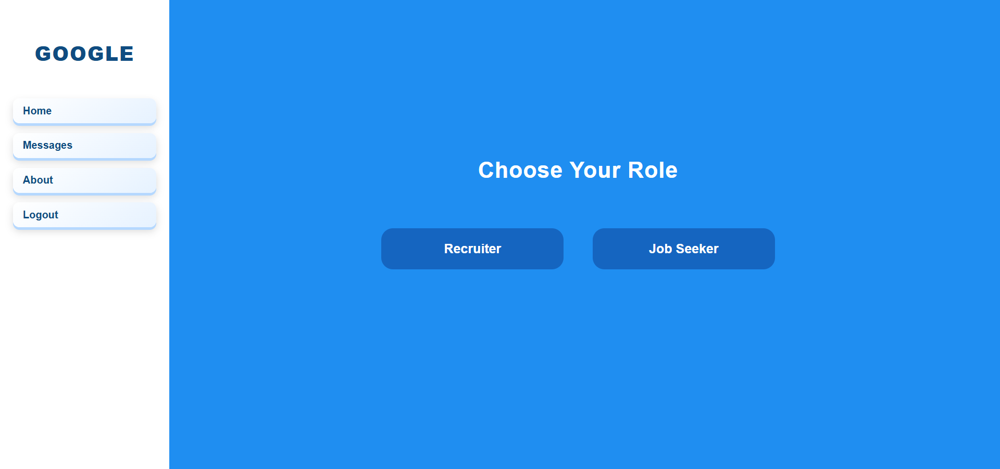
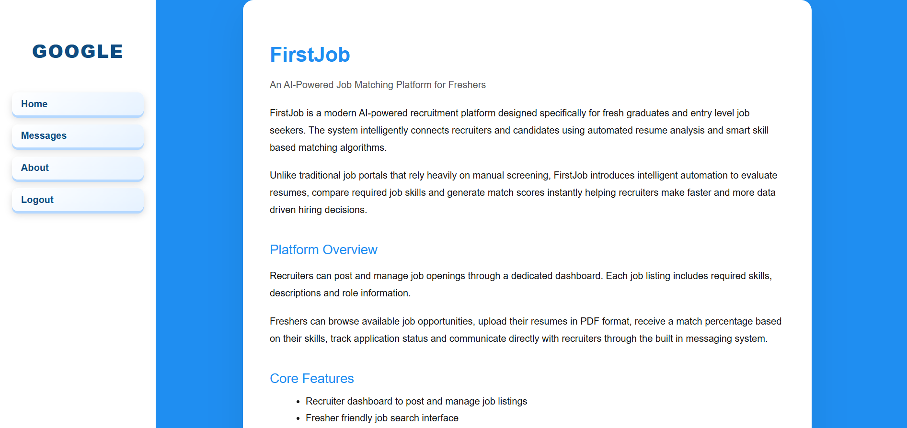
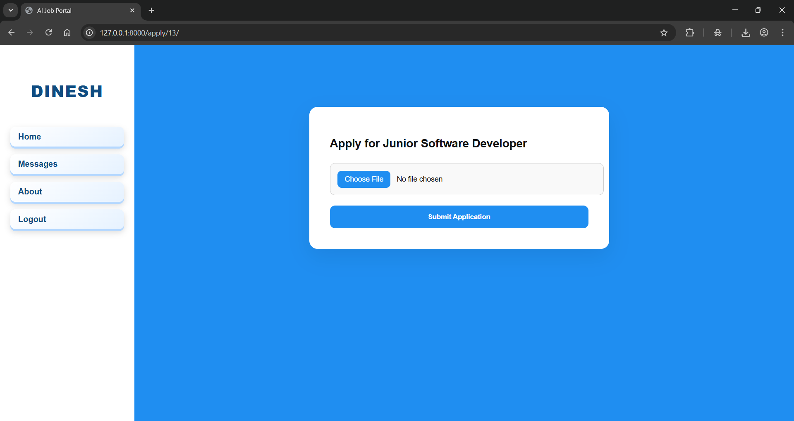
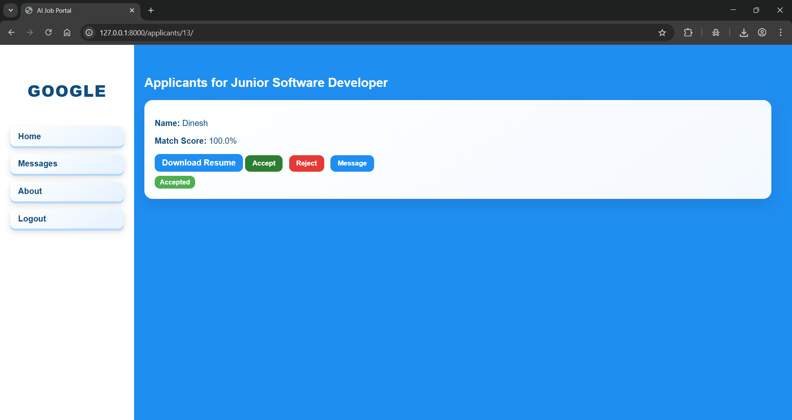
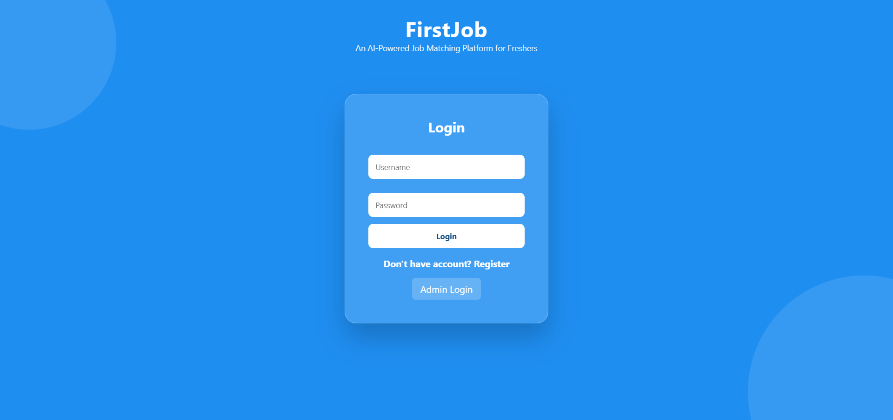
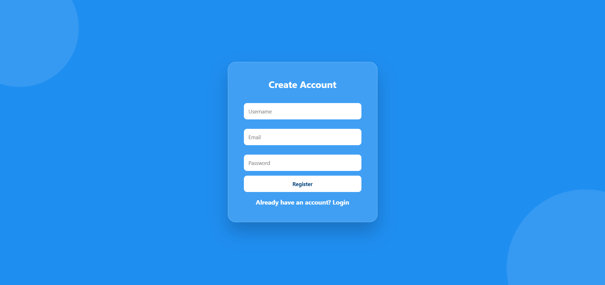
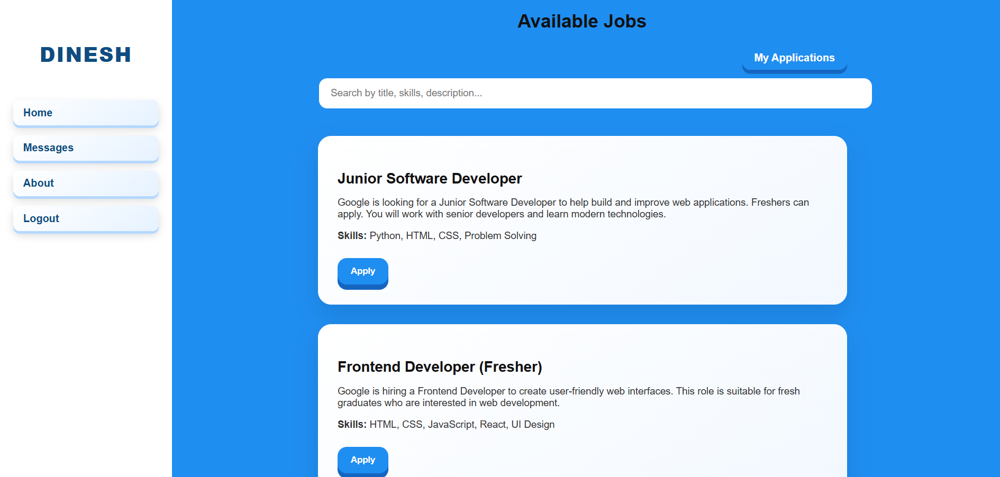
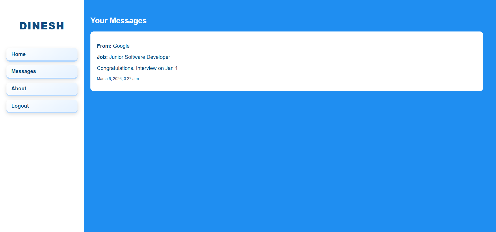
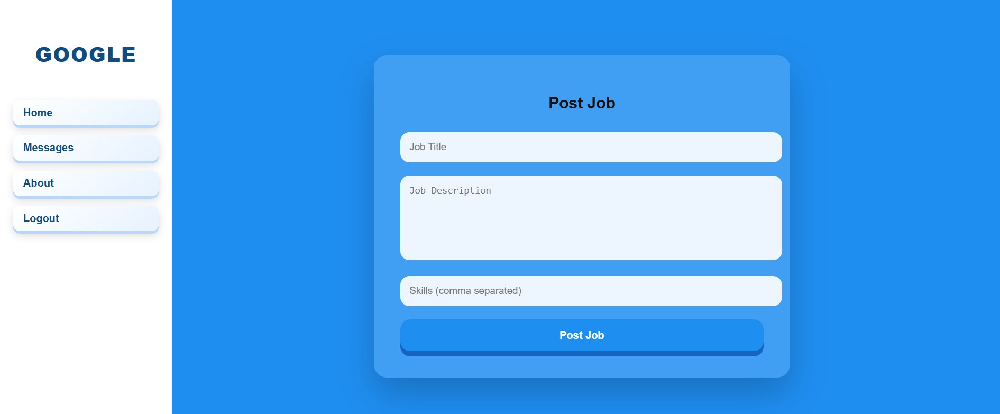
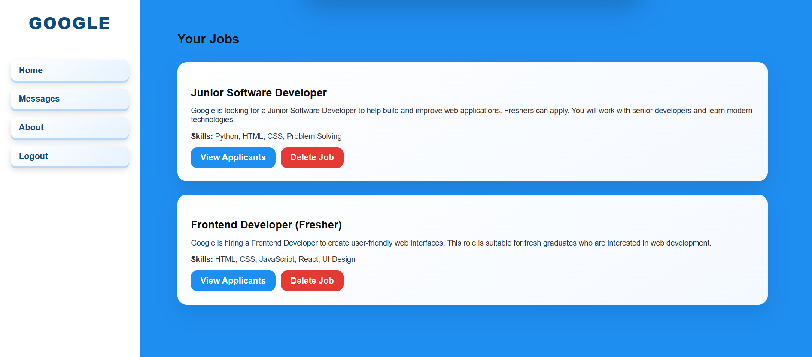

FirstJob
AI-Powered Job Matching Platform for Freshers

FirstJob is a modern AI-powered recruitment platform designed specifically for fresh graduates and entry-level job seekers. The platform intelligently connects recruiters and candidates using automated resume analysis and smart skill-based matching algorithms.

Unlike traditional job portals that rely heavily on manual screening, FirstJob introduces intelligent automation to evaluate resumes, compare required job skills and generate match scores instantly. This helps recruiters make faster and more data-driven hiring decisions while also giving freshers a fair chance to showcase their abilities.

Platform Overview

Recruiters can post and manage job openings through a dedicated dashboard. Each job listing includes required skills, job descriptions, and role information. Freshers can browse available job opportunities, upload their resumes in PDF format, receive a match percentage based on their skills, track their application status, and communicate directly with recruiters through the built-in messaging system.

Core Features

- Recruiter dashboard to post and manage job listings
- Fresher friendly job search interface
- Secure PDF resume upload system
- Intelligent resume skill extraction
- Automated job resume matching score calculation
- Accept or reject candidate workflow
- Application status tracking for job seekers
- Direct messaging system between recruiters and applicants
- Clean, modern and responsive user interface design

AI and Intelligent Matching

FirstJob uses intelligent rule based matching logic to analyze resume content and compare extracted skills with job requirements. Based on keyword similarity and skill overlap, the platform generates an eligibility percentage score that assists recruiters in shortlisting candidates more efficiently.

Technology Stack

- Python and Django used for backend development
- MySQL used for database management
- HTML and CSS used for frontend interface design

The vision of FirstJob is to simplify and transform the job search journey for freshers who often struggle to get their first opportunity due to lack of experience. Many talented graduates face repeated rejections, unanswered applications, and uncertainty about where to begin their careers. FirstJob aims to bridge this gap by introducing intelligent automation into the recruitment process, ensuring that candidates are evaluated based on their real skills and potential rather than just prior experience. By connecting deserving freshers with the right opportunities and helping recruiters discover hidden talent faster, FirstJob aspires to empower young professionals to take their first confident step into the world of work and build a meaningful career.

Created By
Dinesh Pandiyan 

Project Screenshots

Home

About

Apply Job

Applicants Page

Login Page

Register Page

Job Seeker Dashboard

Job Seeker Applications

Job Seeker Messages

Recruiter Dashboard 1

Recruiter Dashboard 2

Recruiter Messages

